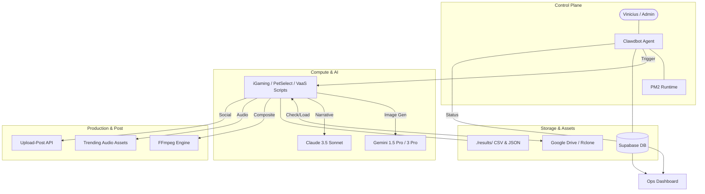
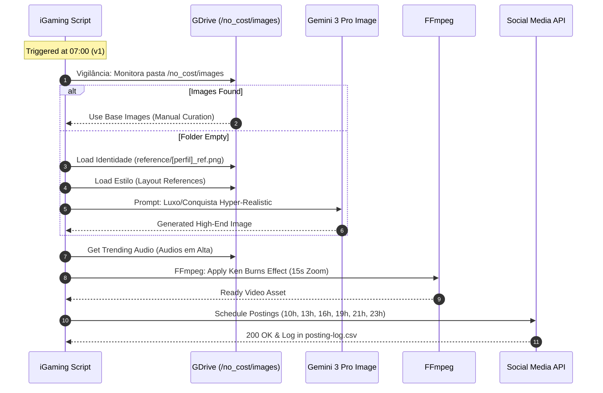
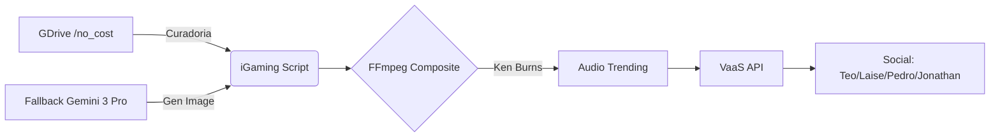
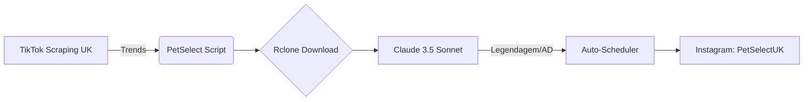
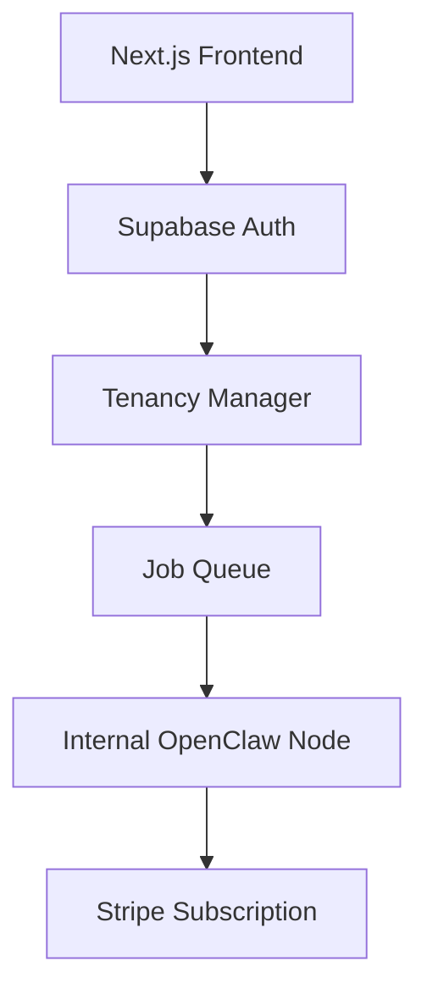

# Empire Architecture: Macro & Micro Views

This document outlines the architectural structure of the Empire Command Center and the specific "Vertical iGaming" content generation flow.

## 1. Macro Architecture (Higher Level)

The macro architecture shows the integration between the orchestrator (Clawdbot/Alex), the AI engines, asset storage, and the final distribution channels.

## 2. Micro Architecture: Vertical iGaming Flow

Detailed logic for the daily generation of Reels for profiles: **Teo, Laise, Pedro, Jonathan**.

## 3. Deployment & Scalability
- **Process Manager**: All core agents run under `pm2` for auto-restart and log rotation.
- **Data Sync**: Local logs are periodically synced to Supabase for global visibility in the Ops Dashboard.
- **Multitenancy**: The script handles multiple profiles by switching context paths (`/no_cost/images`, `reference/`, etc.) based on the profile owner.

## 4. Guia Operacional do Time (Operational Guide)

Para que o império funcione em escala, as responsabilidades estão divididas da seguinte forma:

| Papel | Responsabilidade | Ferramenta Principal |
| :--- | :--- | :--- |
| **Curadoria (Teo/Laise/etc)** | Alimentar GDrive `/no_cost/images` com fotos reais | Google Drive |
| **Operador de IA (Alex)** | Monitorar PM2 e logs de erro do Clawdbot | CLI / Dashboard |
| **Head de Marketing** | Analisar métricas em `MarketingSummary` e ajustar agenda | Ops Dashboard |
| **Desenvolvedor** | Criar novas skills e otimizar scripts de vídeo | VS Code / GitHub |

### Ação Necessária por Status:
- **`queued`**: Aguardando processamento. Nenhuma ação necessária.
- **`scheduled`**: Post pronto e agendado. Monitorar se entra em `pending`.
- **`status_check_failed`**: Erro de comunicação. Operador deve conferir no Instagram.

## 5. Catálogo de Skills & Capacidades (OpenClaw)

O OpenClaw (evolução do Clawdbot) possui as seguintes capacidades integradas:

### Nucleares (Core)
- **`goplaces`**: Integração com Google Places para busca de localizações e inteligência geográfica.
- **`openai-image-gen`**: Geração de imagens via DALL-E 3 para assets complementares.
- **`openai-whisper-api`**: Transcrição de áudio ultra-precisa para legendagem.
- **`nano-banana-pro`**: Motor proprietário de análise rápida de tendências.

### Verticais (Empire)
- **iGaming Engine**: Motor de vídeo 4K focado em estética de luxo e apostas.
- **PetSelect UK**: Curadoria e tradução estratégica de conteúdo viral pet.
- **VaaS (Posting)**: Sistema de agendamento e postagem multicanal (Instagram/TikTok).
- **ElevenLabs TTS**: Narração humanizada para vídeos narrados.

---
> [!NOTE]
> Todos os logs de execução são consolidados em `results/` e sincronizados via Supabase para transparência total.

## 6. Arquitetura Detalhada por Projeto (Project-Specific Flows)

Para maior clareza operacional, abaixo estão os fluxos isolados de cada vertical do Império.

### A. iGaming Empire (VaaS)
Focado em volume e estética de alto padrão.

### B. PetSelect UK (Dropship)
Focado em curadoria viral e arbitragem de conteúdo.

### C. VaaS (Software & Tenancy)
A camada de produto que escala a infraestrutura.

---
> [!IMPORTANT]
> A manutenção da **identidade visual** de cada perfil (Teo, Laise, etc.) é garantida pelo uso de pastas `/reference` específicas que o script consulta antes de gerar qualquer imagem via IA.
